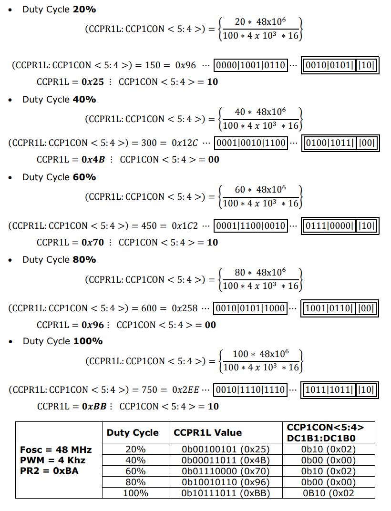

## Theory

##### 1. PWM Technique

##### 2. CCP Module of PIC uC 

  Depending upon the device selected there are 1 – 4 CCP (Capture/Compare/PWM) modules in PIC micro controller. Each module contains a 16-bit register, which can operate as a 16-bit Capture register, a 16-bit Compare register or a PWM Master/Slave Duty Cycle register. Each Capture/Compare/PWM module is associated with a control register (generically, CCPxCON) and a data register (CCPRx). The data register, in turn, is comprised of two 8-bit registers: CCPRxL (low byte) and CCPRxH (high byte). All registers are both readable and writable. The CCP modules utilize Timers 1, 2 or 3, depending on the mode selected. Timer1 and Timer3 are available to modules in Capture or Compare modes, while Timer2 is available for modules in PWM mode.
    The pin assignment for CCP2 (Capture input, Compare and PWM output) can change, based on device configuration. The CCP2MX Configuration bit determines which pin CCP2 is multiplexed to. By default, it is assigned to RC1 (CCP2MX = 1). If the Configuration bit is cleared, CCP2 is multiplexed with RB3. Changing the pin assignment of CCP2 does not automatically change any requirements for configuring the port pin. Users must always verify that the appropriate TRIS register is configured correctly for CCP2 operation, regardless of where it is located.
  
##### 2.1 Capture Mode Applications 

- Event arrival time recording 
- Period measurement 
- Pulse-width measurement 
- Interrupt generation 
- Event counting 
- Time reference 
- Duty cycle measurement 

##### 2.2 Compare Mode Applications 

 - Generate … 
   * Single pulse  
   * Train of pulses  
   * Periodic waveform  
- Start ADC conversion 
- Time reference

#### 3. PWM Mode of CCP Module 

 In Pulse-Width Modulation (PWM) mode, the CCPx pin produces up to a 10- bit resolution PWM output. Since the CCP2 pin is multiplexed with a PORTB or PORTC data latch, the appropriate TRIS bit must be cleared to make the CCP2 pin an output. A PWM output has a time base (period) and a time that the output stays high (duty cycle). The frequency of the PWM is the inverse of the period (1/period).
    The simplified block diagram of the CCP1 configured to generate PWM is shown in Figure 1. with example waveforms in Figure 2. The block diagram for CCP2 is similar to CCP1. It can be seen that Figure 1. contains CCPR1L, Timer 2, comparator and the PR2 register working together. Although not shown, Timer 2 is still driven from the on-chip oscillator, through its own prescaler. The comparator output drives an R–S flip-flop. When the value in PR2 equals Timer 2, then the comparator clears the timer and sets the flip-flop, whose output goes high. This is seen in Figure 2. This action sets the PWM period.
   Having established the PWM period, let us consider how the pulse width is determined. A second Compare register arrangement is introduced to do this. This is made up of the CCPR1H register, plus a second comparator. As the logic of the diagram shows, every time this comparator finds equal input values, it resets the output flip-flop, clearing the output to zero. It is this comparator that determines the pulse width. Again, this is shown in Figure 2. To change the pulse width, the programmer writes to the CCPR1L register, which acts as a buffer. Its value is transferred to CCPR1H only when a PWM cycle is complete, to avoid output errors in the process. The block diagram is made more complex because three of the registers are ‘stretched’, to make them potentially 10-bit instead of 8-bit. This increases the resolution. CCPR1L uses two bits of the CCP1CON register. CCPR1H is extended with an internal 2-bit latch, while the extension to Timer 2 is as described in Note 1 of Figure 1. Because of these two extra bits, in its 10-bit version it is effectively clocked direct from the internal oscillator signal, undivided. If the prescaler is used, then it acts on this frequency, not the usual Fosc/4. Notice, however, that the PR2 register remains at eight bits. This means that the PWM period has only an 8-bit equivalent resolution.

##### 3.1 PWM Period and Duty Cycle 

The PWM period T is determined by the interaction of the PR2 register and the eight 
bits of Timer 2. It may be calculated as follows: 

Where,  
Timer 2 input Clock = 4 \* Tosc \* TMR2 Prescaler value  
Fosc = Input Crystal Oscillator Frequency  
Tosc = input clock period = 1/Fosc  
Fpwm = PWM frequency  
Tpwm = PWM Period = 1/Fpwm 

The PWM pulse width Ton is determined by the interaction of the extended CCPR1H register (all 10 bits of it) and the extended (10-bit) Timer2. It may be calculated as follows:  
	**Ton = (Pulse width register) x (PWM Timer input clock period)**   
Where, ‘PWM timer input clock period’ is the period of the clock input to the extended Timer 2 and ‘pulse width register’ is the value in the extended CCPR1L register.  
Hence,  
	**Ton = (CCPR1L: CCP1CON<5:4>) x (Tosc \* TMR2 Prescaler value)**   
Note that there is not here a factor of four with the Tosc term, as we are using 10-bits of Timer 2. Rearranging the above equation, to find value of pulse width register (CCPR1L: CCP1CON <5:4>).

 
##### 3.2 Pin Description

| Signal        | Pin No.       | Symbol|
| ------------- |:-------------:| ------:|
| CCP2^(1)|16|RC1/T1OSI/CCP2^(1)/UOE|
| CCP1|17|RC2/CCP1/P1A|
| CCP2^(1) |36| RB3/AN9/CCP2^(1)/VPO|

**Note 1: RB3 is the alternate pin for CCP2 multiplexing.**

##### 3.3 PWM Register Map: 

|SFR|Description| Access| Reset Value| Address|
|---|:---------:| -----:|----------- |:------:|
|CCP1CON| Standard CCP1 Control Reg.|Read/Write|0x00|0xFBD|
|CCPR1L |CCP1 Register low byte| Read/Write| unknown| 0xFBE|
|CCPR1H| CCP1 Register high byte| No access| unknown| 0xFBF|
|CCP2CON |Standard CCP2 Control Reg.| Read/Write |0x00 |0xFBA|
|CCPR2L |CCP2 Register high byte| Read/Write| unknown| 0xFBB|
|CCPR2H| CCP2 Register high byte| No access| unknown| 0XFBC|
|T2CON| Timer 2 Control Register| Read/Write| 0x00| 0xFCA|
|TMR2 |Timer 2 Register| Read/Write| 0x00 |0xFCC|
|PR2 |Timer 2 Period register |Read/Write| 0xFF| 0xFCB|

##### 3.4 PWM Mode Register Description

##### 3.4.1 Standard CPPx Control Register (CCPxCON – CCP1CON/CCP2CON)

|U-0|U-0|R/W-0|R/W-0|R/W-0|R/W-0|R/W-0|R/W-0|
| ------ |:--------:| ------:|---------- |:---------:| ----:| --------- |:-------------:|
|_(1)|_(1)|DCxB1|DCxB0|CCPxM3|CCPxM2|CCPxM1|CCPxM0|
|bit 7|||||||bit 0|

| Bit No. | Control Bit  | Description|
| ---------- |:-------------:| :------:|
|Bit 7 - 6|Unimplemented|Read as '0'|
|Bit 5 - 4|DCxB1:DCxB0|PWM Duty Cycle Bit 1 and Bit 0 for CCPx Module Unused in Capture mode & Compare mode:   PWM mode: These bits are the two LSbs (bit 1 and bit0) of the 10-bit PWM duty cycle. The eight MSbs of the duty cycle are found in CCPR1L.|
|Bit 3 - 0|CCPxM3:CCPxM0|CCPx Module Mode Select bits   0000 = CCP disabled (resets CCPx module)   0001 = Reserved   0010 = Compare mode: toggle output on match (CCPxIF bit is set)   0011 = Reserved   0100 = Capture mode: every falling edge   0101 = Capture mode: every rising edge   0110 = Capture mode: every 4th rising edge   0111 = Capture mode: every 16th rising edge   1000 = Compare mode: initialize CCPx pin low; on compare match, force CCPx pin high (CCPxIF bit is set)   1001 = Compare mode: initialize CCPx pin high; on compare match, force CCPx pin low (CCPxIF bit is set)   1010 = Compare mode: generate software interrupt on compare match (CCPxIF bit is set, CCPx pin reflects I/O state)   1011 = Compare mode: trigger special event, reset timer, start A/D conversion on CCP2 match (CCPxIF bit is set)   **11xx = PWM mode** |

##### 3.4.2 Timer 2 Control Register

|U-0|R/W-0|R/W-0|R/W-0|R/W-0|R/W-0|R/W-0|R/W-0|
| ------ |:--------:| ------:|---------- |:---------:| ----:| --------- |:-------------:|
|-|T2OUTPS3|T2OUTPS2|T2OUTPS1|T2OUTPS0|TMR2ON|T2CKPS1|T2CKPS0|
|bit 7|||||||bit 0|

| Bit No. | Control Bit  | Description|
| ---------- |:-------------:| :------:|
|Bit 6 - 3| T2OUTPS3:T2OUTPS0: | Timer2 Output Postscaler Select bits (1:1 to 1:16)   0000 = 1:1 Postscaler   0001 = 1:2 Postscale   .   .   1111 = 1:16 Postscaler |
| Bit 2 | TMR2ON:  |Timer2 On bit   1 = Timer2 is on, 0 = Timer2 is off|
| Bit 1 - 0| T2CKPS1:T2CKPS0   |Timer2 Clock Prescaler Select bits   00 = Prescaler is 1:1   01 = Prescaler is 1:4   1x = Prescaler is 1:16|

#### 4. Timer 2 Module 

The Timer2 module timer incorporates the following features: 
- 8-bit timer and period registers (TMR2 and PR2, respectively) 
- Readable and writable (both registers) 
- Software programmable prescaler (1:1, 1:4 and 1:16) 
- Software programmable Postscaler (1:1 through 1:16) 
- Interrupt on TMR2 to PR2 match 
- Optional use as the shift clock for the MSSP module 
The module is controlled through the T2CON register which enables or disables the timer and configures the prescaler and Postscaler. Timer2 can be shut off by clearing control bit, TMR2ON (T2CON<2>), to minimize power consumption. 
A simplified block diagram of the module is shown in Figure 3.

##### 4.1 Timer2 Operation 

In normal operation, TMR2 is incremented from 00h on each clock (FOSC/4). A 2-bit counter/prescaler on the clock input gives direct input, divide-by-4 and divide-by- 16 prescale options. These are selected by the prescaler control bits, T2CKPS1:T2CKPS0 (T2CON <1:0>). The value of TMR2 is compared to that of the period register, PR2, on each clock cycle. When the two values match, the comparator generates a match signal as the timer output. This signal also resets the value of TMR2 to 00h on the next cycle and drives the output counter/ Postscaler.
   The TMR2 and PR2 registers are both directly readable and writable. The TMR2 register is cleared on any device Reset, while the PR2 register initializes at FFh. TMR2 is not cleared when T2CON is written. Both the prescaler and postscaler counters are cleared on the following events: 
- a write to the TMR2 register 
- a write to the T2CON register 
- any device Reset (Power-on Reset, MCLR Reset, WDT Reset or Brown-out) 

##### 4.2 Timer2 Interrupt 

  Timer2 also can generate an optional device interrupt. The Timer2 output signal (TMR2 to PR2 match) provides the input for the 4-bit output counter/postscaler. This counter generates the TMR2 match interrupt flag which is latched in TMR2IF (PIR1<1>). The interrupt is enabled by setting the TMR2 Match Interrupt Enable bit, TMR2IE (PIE1<1>). A range of 16 postscale options (from 1:1 through 1:16 inclusive) can be selected with the postscaler control bits, T2OUTPS3:T2OUTPS0 (T2CON<6:3>). 

##### 4.3 TMR2 Output 

 The unscaled output of TMR2 is available primarily to the CCP modules, where it is used as a time base for operations in PWM mode. Timer2 can be optionally used as the shift clock source for the MSSP module operating in SPI mode. 

#### 5. Calculation for PWM operation 

**Desired PWM Frequency = 4 KHz** 

Therefore,

**b. For Fosc = 48 MHz**

#### 6. Quadruple half H Drivers (L293D) 

 The L293D is quadruple high-current half-H drivers. The L293D is designed to provide bidirectional drive currents of up to 600-mA at voltages from 4.5 V to 36 V. The device is designed to drive inductive loads such as relays, solenoids, dc and bipolar stepping motors, as well as other high-current/high-voltage loads in positive-supply applications. All inputs are TTL compatible. Each output is a complete totem-pole drive circuit, with a Darlington transistor sink and a pseudo-Darlington source. 
   Drivers are enabled in pairs, with drivers 1 and 2 enabled by 1,2EN and drivers 3 and 4 enabled by 3,4EN as shown in pin diagram and function table. When an enable input is high, the associated drivers are enabled, and their outputs are active and in phase with their inputs. When the enable input is low, those drivers are disabled, and their outputs are off and in the high-impedance state. With the proper data inputs, each pair of drivers forms a full-H (or bridge) reversible drive suitable for solenoid or motor applications. 

