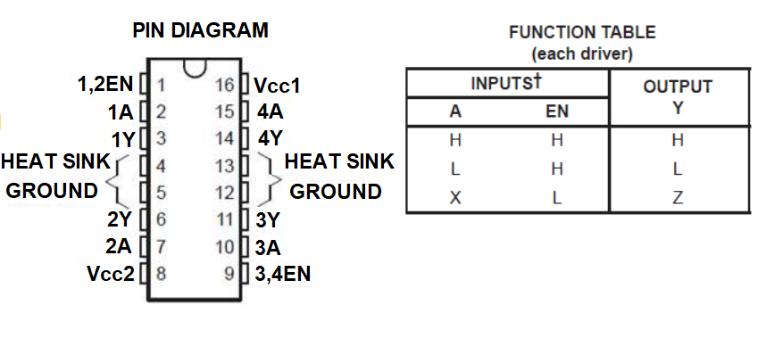

### Theory

The Timer2 module timer incorporates the following features:
- 8-bit Timer and Period registers (TMR2 and PR2, respectively) 
- Readable and writable (both registers)
- Software programmable prescaler (1:1, 1:4 and 1:16)
- Software programmable postscaler (1:1 through 1:16) 
- Interrupt on TMR2 to PR2 match

Optional use as the shift clock for the MSSP module The module is controlled through the T2CON register (Register 13-1) which enables or disables the timer and configures the prescaler and postscaler. Timer2 can be shut off by clearing control bit, TMR2ON (T2CON), to minimize power consumption.

#### Working of PWM mode

1. Load the period value in a PR2 register and the duty cycle value in CCPR1L: CCP1CON<5: 4> registers and initialize the CCP1 pin as an output.
2. Configure the T2CON register and set the TMR2 register to 0. Also, start Timer2.
3. Now when a match occurs between registers PR2 and TMR2, pin CCP1 is pulled high and TMR2 is cleared.
4. The value of CCPR1L along with the CCP1CON<5: 4> which is a count for duty cycle is moved to the CCPR1H.
5. Finally, TMR2 is compared with the CCPR1H along with two lower bits of a duty cycle. When matched, the pin CCP1 goes low.

#### T2CON: TIMER2 CONTROL REGISTER

#### CCPR1H and CCPR1L register:

In the CCP module, there is a 16-bit register which is split into two 8-bit registers - CCPR1H and CCPR1L.

- Only CCPR1L is used to decide the duty cycle of the PWM. CCPR1H is not user-accessible for the PWM mode.
- As the PIC18F4550 generates a 10-bit PWM pulse, to set the duty cycle it uses a 10-bit register. The higher 8 bits (MSBs) DC1B9: DC1B2 of this register are in CCPR1L register (8-bit) and lower 2 bits(LSBs) DC1B1: DC1B0, which are used for a decimal portion in duty cycle, are in CCP1CON register at bit 5 and 4 respectively.
- So the 10-bit value for duty cycle is represented by CCPR1L: CCP1CON<5: 4>

#### PR2 register

- It is an 8-bit register that is used to load a count for a period of the pulse (TPWM).

**CCP1CON:** ENHANCED CAPTURE/COMPARE/PWMCONTROL REGISTER

**DC1B1: DC1B0**
These two bits are LSBs which are used for defining the decimal value of a duty cycle.

**CCP1M3: CCP1M0:** CCP1 module mode select bits
**11xx** = PWM mode
Other combinations are used to capture and compare modes.

To set the period of the pulse:

- Timer prescaler value is 1 if not prescaler is set.

To set the duty cycle, load CCPR1L as per below equation:

#### Schematic

Components used in simulation:
- Microcontroller : PIC18F4550
- Aqua color LED
- Resistor: 330 Ohms
- Oscilloscope

In this Example schematic, LED is connected across RC0 of the PORT C of the microcontroller as per the timer pin for PWM output.

